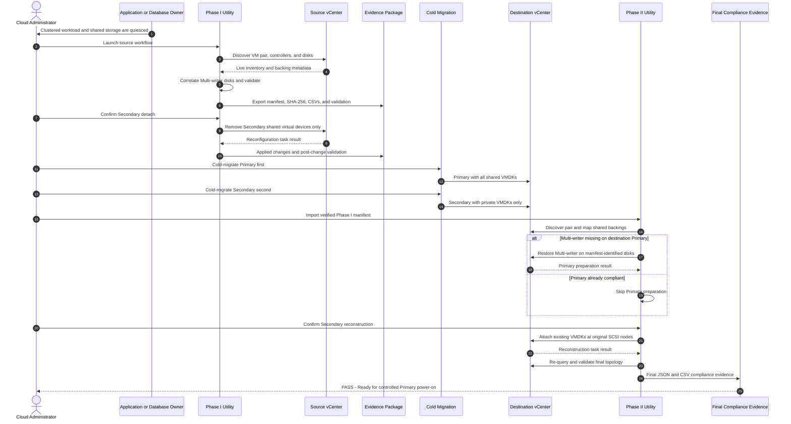

# vSphere Shared-Disk Cluster Migration Assistant

**A two-phase PowerShell WPF toolkit for preparing, reconstructing, and validating clustered or application VM pairs that use shared Multi-writer VMDKs during a cold cross-vCenter migration.**

The toolkit uses a checksum-protected Phase I manifest as the contract between source preparation and destination reconstruction. It is application-neutral and can support a validated clustered database, file service, middleware platform, or other guest-cluster design that uses supported shared Multi-writer VMDKs.

> [!CAUTION]
> The toolkit does not migrate or power on VMs. It does not create, convert, move, or delete VMDKs. Guest shutdown, startup, quorum, cluster, database, and application validation remain the responsibility of the appropriate system owners.

## Final releases

- `vSphere_Shared_Disk_Cluster_Migration_Assistant_Phase_I_Final_v1.2.0.ps1`
- `vSphere_Shared_Disk_Cluster_Migration_Assistant_Phase_II_Final_v2.2.0.ps1`
- `vSphere-Shared-Disk-Cluster-Migration-Assistant_Runbook_Generic_Final_v2.1.xlsx`

## Architecture and wire flow



## Supported operating model

### Primary VM

- Retains all private and shared VMDKs during migration.
- Remains powered off until Phase II finishes.
- Provides the authoritative destination attachment for shared-disk mapping.
- Receives controlled Multi-writer restoration only for disks recorded as shared in the Phase I manifest.

### Secondary VM

- Has only manifest-identified Multi-writer devices detached.
- Retains all private disks and controller topology.
- Migrates with private disks only.
- Receives the existing destination shared VMDKs at the original SCSI nodes during Phase II.

## Safety boundaries

- Both VMs must be powered off before configuration changes.
- Shared disks are identified from live inventory and the manifest, not labels alone.
- Mapping uses UUID plus capacity, with base name plus capacity as a controlled fallback.
- Ambiguous mapping is blocking.
- `FileOperation` remains unset.
- VMDK backing files are never deleted.
- The Primary is never detached from its shared disks.
- Secondary target SCSI nodes must be available before reconstruction.
- Added Secondary devices use unique temporary negative device keys.
- Neither utility migrates or powers on VMs.

## Requirements

- Windows administration workstation
- PowerShell 7 or later in STA mode
- `VCF.PowerCLI`
- TCP 443 connectivity to the applicable vCenter
- Approved vCenter read and VM reconfiguration permissions
- A supported guest-cluster or application design using shared Multi-writer VMDKs
- Destination storage that supports the required Multi-writer design
- Both VMs powered off before detach, preparation, or reconstruction
- No snapshots, unresolved consolidation, unsupported CBT condition, RDM, or unsupported backing type

## Quick start

### Phase I

```powershell
cd C:\Script
.\vSphere_Shared_Disk_Cluster_Migration_Assistant_Phase_I_Final_v1.2.0.ps1
```

1. Select the evidence output folder.
2. Connect to the source vCenter.
3. Enter the Primary and Secondary VM names.
4. Discover and validate the pair.
5. Export the manifest and evidence.
6. After the workload owner handoff and VM shutdown, refresh and revalidate.
7. Preview and execute the controlled Secondary detach.
8. Proceed only at `PASS: READY FOR COLD MIGRATION`.

### Migration hold point

1. Cold-migrate the Primary first with all disks attached.
2. Keep the destination Primary powered off.
3. Cold-migrate the Secondary with private disks only.
4. Keep the destination Secondary powered off.
5. Do not manually attach shared disks.

### Phase II

```powershell
cd C:\Script
.\vSphere_Shared_Disk_Cluster_Migration_Assistant_Phase_II_Final_v2.2.0.ps1
```

1. Connect to the destination vCenter.
2. Import the successful Phase I manifest.
3. Discover and validate the destination pair.
4. If required, select **Prepare Destination Primary**.
5. Continue only after readiness becomes `Pass`.
6. Execute destination reconstruction.
7. Review final JSON and CSV evidence.
8. Proceed only at `PASS: READY FOR CONTROLLED PRIMARY POWER-ON`.

## Evidence outputs

### Phase I

```text
vSphere-SharedDisk-Migration-<timestamp>\
├── SharedDiskMigrationManifest.json
├── SharedDiskMigrationManifest.sha256
├── VM-Summary.csv
├── ControllerInventory.csv
├── DiskInventory.csv
├── SharedDiskCorrelation.csv
├── PreChange-Validation.json
├── PlannedChanges.json
├── AppliedChanges.json
├── PostChange-Validation.json
├── operational log and transcript
└── Debug-Artifacts\
```

### Phase II

```text
vSphere-SharedDisk-PhaseII-<timestamp>\
├── Destination-PreReconstruction-Validation.json
├── Destination-Primary-Preparation-Applied.json
├── Destination-Reconstruction-Applied.json
├── Destination-Final-Validation.json
├── Destination-Final-Mappings.csv
├── operational log and transcript
└── Debug-Artifacts\
```

The Primary preparation file is created only when preparation is required.

## Final compliance criteria

- Both VMs remain powered off.
- Each shared backing exists exactly once on each VM.
- Canonical destination paths, UUIDs, and capacities match.
- Both devices report Multi-writer.
- Secondary devices report `independent_persistent`.
- Original Secondary SCSI nodes are restored.
- `TargetNodeOccupiedByExpectedDisk` is `True`.
- `FinalStateCompliant` is `True`.
- `ReconstructionStatus` is `Compliant`.

## Application-neutral validation

The toolkit validates vSphere configuration only. Before service restoration, the responsible owners must validate the applicable guest and product controls, such as:

- Shared-device discovery and stable device identifiers
- Guest multipathing or device rules
- Cluster membership and interconnects
- Quorum, witness, reservation, or lock state
- Database or application service groups
- Data integrity and application consistency
- Failover or ownership transfer when approved

## Repository layout

```text
vSphere-SharedDisk-Cluster-Migration-Assistant\
├── Phase-I\
│   └── vSphere_Shared_Disk_Cluster_Migration_Assistant_Phase_I_Final_v1.2.0.ps1
├── Phase-II\
│   └── vSphere_Shared_Disk_Cluster_Migration_Assistant_Phase_II_Final_v2.2.0.ps1
├── Documentation\
│   ├── vSphere-Shared-Disk-Cluster-Migration-Assistant_Runbook_Generic_Final_v2.1.xlsx
│   └── Wiki.md
├── README.md
└── LICENSE
```

## Release history

### Phase II Final v2.2.0

- Verified Phase I evidence import
- Destination mapping by UUID and capacity
- Recoverable Primary Multi-writer preparation
- Unique temporary negative device keys
- Exact Secondary SCSI-node reconstruction
- Final compliance JSON and CSV evidence
- Current and legacy connection-profile support

### Phase I Final v1.2.0

- Complete source inventory and shared-disk correlation
- Checksum-protected evidence export
- Controlled Secondary detach
- Typed confirmation and drift protection
- Post-change validation

